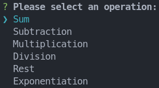

# calculator-cli




> This is a simple CLI calculator made in TypeScript and [_inquirer.js_](https://github.com/SBoudrias/Inquirer.js/). Performs basics operations such as: sum, subtraction, multiplication, division, rest and exponentiation.

## 💻 Prerequisites

- Node

- NPM or YARN

- Your favorite IDE (recommend [VS Code](https://code.visualstudio.com/))

## 💻 Technology

- TypeScript

- Inquirer.js

## 🚀 Installation

```bash
# Repository clone
$ git clone https://github.com/ImGabreuw/calculator-cli.git

# Go to the application directory
$ cd calculator-cli/

# Install dependencies
$ npm i

# Run Application
$ npm run dev
```

## 📫 Contribution

To contribute to **calculator-cli**, follow these steps:

1. Fork this repository.
2. Create a branch: `git checkout -b feature/<feature>`.
3. Make your changes and confirm them: `git commit -m 'some description for feature'`
4. Send to the original branch: `git push origin <branch>`
5. Create the pull request.

Alternatively, refer to the GitHub documentation at [how to create a pull request](https://help.github.com/en/github/collaborating-with-issues-and-pull-requests/creating-a-pull-request).

## 🤝 Contributors

We thank the following people who contributed to this project:

<table>
  <tr>
    <td align="center">
      <a href="https://github.com/ImGabreuw">
        <br>
        <sub>
          <b>ImGabreuw</b>
        </sub>
      </a>
    </td>
  </tr>
</table>

## 😄 Be one of the contributors<br>

Want to be part of this project? Click [HERE](CONTRIBUTING.md) and read how to contribute.

## 📝 License

This project is under license. See the archive [LICENSE](LICENSE.md) for more details.

[⬆ Back to the top](#calculator-cli)<br>
